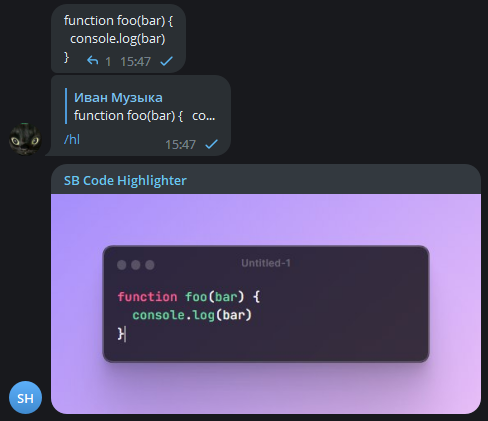

# telegram-clicker

Telegram бот создающий красивый скриншот кода в сообщении.

Для использования просто ответьте `/hl` на сообщение с кодом.

## Технологии

- [GrammY](https://grammy.dev/)
- [Typescript](https://www.typescriptlang.org/)

## Запуск

- установите зависимости с помощью `npm i`
- создайте `.env` по шаблону `.env.example`
- запустите `npm run start`
